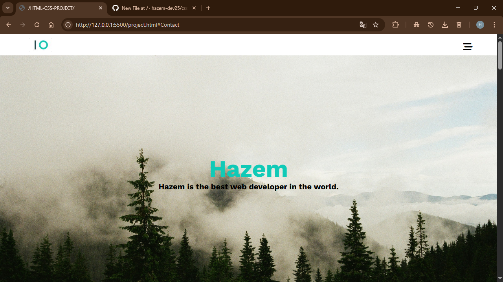

# 🌐 Hazem's Portfolio Website

Welcome to my personal portfolio website! This project showcases my journey as a **self-taught web developer** aiming to become a professional **Back-End Engineer**. It reflects my skills, passion, and commitment to building **modern**, **responsive**, and **user-focused** web experiences.

---

## 🚀 Live Demo

🌍 [Live Preview Coming Soon...](#)  
https://hazem-dev25.github.io/css-html-project/

---

## 🧠 About the Project

This website is **fully hand-coded** using:

- **HTML5** for semantic structure
- **CSS3** for styling, layout, and animations
- **Font Awesome** for scalable icons
- **Google Fonts** for elegant typography
- **Responsive Design** using **flexbox** and **CSS grid**
- **Media Queries** to ensure it looks great on all devices

The design focuses on simplicity, clarity, and usability, with sections that highlight my skills, projects, and future goals.

---

## 📁 Project Structure

📦 Portfolio-Website/
├── 📁 css/
│ ├── all.min.css
│ ├── normalize.css
│ └── styles.css
├── 📁 img/
│ └── [Images used in the site]
├── index.html

---

## 📸 Screenshots

### 🖥️ Desktop View

---

## 📌 Sections Breakdown

- **Header/Navbar**: Minimal with a responsive hamburger menu
- **Landing Section**: Personal intro and short description
- **About Me**: My thoughts, learning path, and personality
- **Services**: The things I’m learning and offering
- **Portfolio**: Projects I built using HTML & CSS
- **Contact**: My contact info and social handles

---

## 💎 Features

- Fully responsive layout 🌐  
- Clean and maintainable code 💡  
- Smooth hover effects and scaling transitions ✨  
- Grid-based sections with logical structure 🧱  
- Mobile-first design approach 📱  
- Simple and elegant UI 🎨

---

## 🎯 My Future Goals

> "Every day I code, I'm not just learning — I'm building my future."

- Master **JavaScript**, **Node.js**, and **Back-End development**
- Learn **database design**, **API building**, and **authentication**
- Become job-ready for **remote positions** in Europe (especially Germany 🇩🇪)
- Keep building real-world projects and improving my portfolio

---

## 🤝 Contact

If you want to collaborate, offer feedback, or just say hi 👋:

- 📧 Email: hadel6464@gmil.com  
- 📞 Phone: +01271725967  
- 🌐 LinkedIn: (coming soon)

---

## 🧠 Author

**Hazem Adel**  
Front-End Learner → Future Back-End Pro  

---

## ⭐️ Show Your Support

If you like this project:

- Give it a ⭐️ on GitHub  
- Share it with your friends  
- Fork it and make it your own  
- Follow my journey — this is just the beginning 🚀

---

## 📝 License

This project is open-source and free to use for educational or personal inspiration.

---

> “Less is more work.” — Hazem Adel
